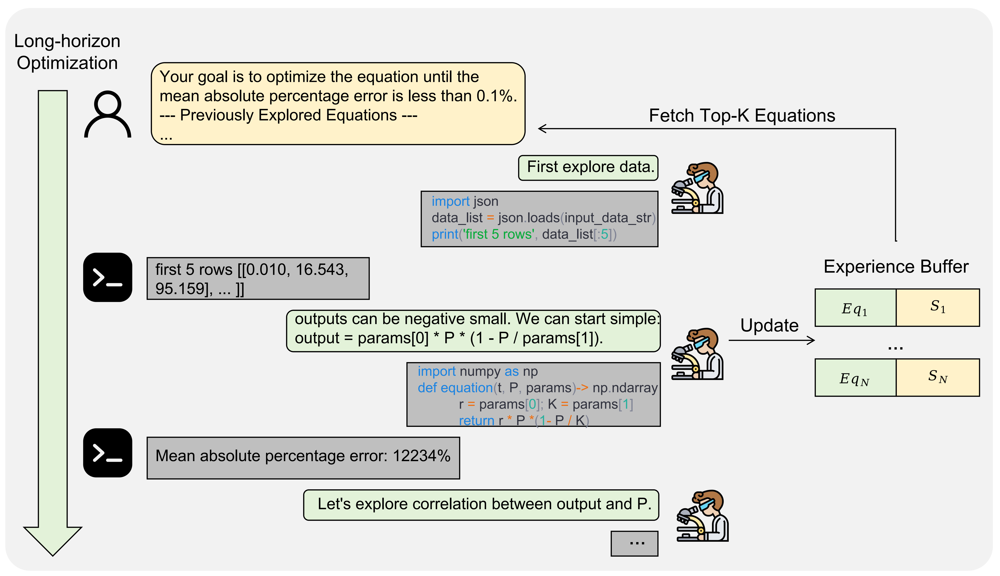

## SR-Scientist: Scientific Equation Discovery With Agentic AI

<p align="left">
📄 <a href="https://arxiv.org/abs/2510.11661" target="_blank">Paper</a> &nbsp; | &nbsp; 🌐 <a href="https://huggingface.co/GAIR/SR-Scientist-30B" target="_blank">Model</a> &nbsp; | &nbsp;📘 <a href="https://huggingface.co/datasets/GAIR/SR-Scientist" target="_blank">Dataset</a>
</p>

This repository presents the open-source resources associated with the paper [SR-Scientist: Scientific Equation Discovery With Agentic AI](https://arxiv.org/abs/2510.11661). We release the inference framework and the RL training framework to reproduce the results of the paper.

### 📰 News
- **[2025/10]** Our paper is now available on arXiv!

### 📜 Table of Contents
- [Overview](#Overview)
- [Inference](#inference)
  - [Inference Setup](#inference-setup)
  - [Inference Usage](#inference-usage)
- [Training](#training)
  - [Training Setup](#training-setup)
  - [Training Usage](#training-usage)
- [License](#license)
- [Citation](#citation)


### Overview

Recently, Large Language Models (LLMs) have been applied to scientific equation discovery, leveraging their embedded scientific knowledge for hypothesis generation. However, current methods typically confine LLMs to the role of an equation proposer within search algorithms like genetic programming. In this paper, we present SR-Scientist, a framework that elevates the LLM from a simple equation proposer to an autonomous AI scientist that writes code to analyze data, implements the equation as code, submits it for evaluation, and optimizes the equation based on experimental feedback. Specifically, we wrap the code interpreter into a set of tools for data analysis and equation evaluation. The agent is instructed to optimize the equation by utilizing these tools over a long horizon with minimal human-defined pipelines. Empirical results show that SR-Scientist outperforms baseline methods by an absolute margin of 6% to 35% on datasets covering four science disciplines. Additionally, we demonstrate our method's robustness to noise, the generalization of the discovered equations to out-of-domain data, and their symbolic accuracy. Furthermore, we develop an end-to-end reinforcement learning framework to enhance the agent's capabilities.

<p align="center">
  
</p>

### Inference

#### Inference Setup

1.  **Clone the Repository**
    ```bash
    git clone https://github.com/GAIR-NLP/SR-Scientist
    cd SR-Scientist
    ```

2.  **Create the Main Conda Environment**
    ```bash
    conda create -n srscientist python=3.11
    conda activate srscientist
    pip install torch==2.8.0
    pip install "sglang[all]==0.5.2"
    pip install h5py
    ```

3.  **Install the Sandbox Environment**
    ```bash
    git clone https://github.com/bytedance/SandboxFusion.git
    cd SandboxFusion
    conda create -n sandbox-runtime python=3.11
    conda activate sandbox-runtime
    
    # Optional: Install poetry if you don't have it
    # curl -sSL https://install.python-poetry.org | python3 -
    # export PATH="/root/.local/bin:$PATH"
    
    poetry install
    mkdir -p docs/build
    cd runtime/python
    pip install -r requirements.txt
    
    # Return to the SandboxFusion root and run a test
    cd ../..
    make run-online
    ```

4.  **Test the Sandbox**

    Run the following `curl` command. A successful setup will return a JSON object with `status: "Success"`.
    ```bash
    curl 'http://localhost:8080/run_code' \
      -H 'Content-Type: application/json' \
      --data-raw '{"code": "print(\"Hello, world!\")", "language": "python"}'
    ```

#### Inference Usage

First, download the `llmsrbench` dataset from Hugging Face and preprocess it.
```bash
# Download from Hugging Face
hf download nnheui/llm-srbench --repo-type dataset --local-dir ./data/inference

# Preprocess the data
python utils/data_preprocessing.py 
```

You can then run inference using the provided scripts. You can either host the model locally or use an API endpoint.

1.  **Prepare the Sandbox**
    ```bash
    bash inference/scripts/sandbox.sh
    ```
2.  **Host the Model Locally (Example with GPT-OSS-120B)**
    ```bash
    bash inference/scripts/sglang_oss_120b.sh
    ```
3.  **Run Inference**
    ```bash
    bash inference/scripts/inference.sh
    ```

Alternatively, you can run the entire pipeline with a single script:
```bash
bash inference/scripts/inference_whole_gpt_oss_120b.sh
```

We support the models used in the paper, including:
- [Qwen3-Coder-480B](https://huggingface.co/Qwen/Qwen3-Coder-480B-A35B-Instruct-FP8)
- [Qwen3-Coder-30B](https://huggingface.co/Qwen/Qwen3-Coder-30B-A3B-Instruct)
- [GLM-4.5-Air](https://huggingface.co/zai-org/GLM-4.5-Air-FP8)
- [GPT-OSS-120B](https://huggingface.co/openai/gpt-oss-120b)
- [GPT-OSS-20B](https://huggingface.co/openai/gpt-oss-20b)

### Training

#### Training Setup

1.  **Download the Dataset**
    ```bash
    hf download GAIR/SR-Scientist --repo-type dataset --local-dir ./data/training
    ```

2.  **Prepare the Environment**
    ```bash
    conda create -n verl python=3.11 
    conda activate verl
    pip install torch==2.7.1 
    pip install flash-attn==2.7.4.post1 --no-build-isolation
    pip install "sglang[all]==0.4.9.post6"
    # Install this repository in editable mode
    pip install -e .
    ```

#### Training Usage

We trained the `qwen3-coder-30B` on 4 nodes, each with 8 H200 GPUs. You can start the training process by running the following script:
```bash
bash verl/examples/sglang_multiturn/train.sh
```

### License

The `SR-Scientist-30B` model and the training set are released under the **Apache License 2.0**.

### Citation

Please cite the paper if the resource in this repo or the paper is helpful to you.
```bibtex
@misc{xia2025srscientist,
      title={SR-Scientist: Scientific Equation Discovery With Agentic AI}, 
      author={Shijie Xia and Yuhan Sun and Pengfei Liu},
      year={2025},
      eprint={2510.11661},
      archivePrefix={arXiv},
      primaryClass={cs.AI},
      url={https://arxiv.org/abs/2510.11661}, 
}
```
